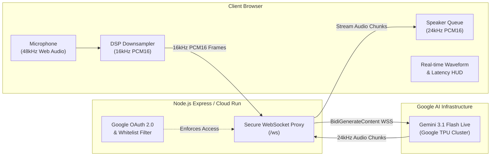

# Uber Voice Concierge — Powered by Google Gemini Multimodal Live API

A production-ready, ultra-low-latency bidirectional voice assistant built on **Google Gemini 3.1 Flash Live (`models/gemini-3.1-flash-live-preview`)**. 

This demo showcases a real-time conversational voice concierge capable of planning rides, recommending local restaurants, adjusting travel itineraries, and interacting conversationally with human-like vocal cadence and sub-second Time-to-First-Byte (TTFB) latency.

---

## 🌟 Key Features

* **Direct Audio-to-Audio Streaming**: Zero speech-to-text (STT) or text-to-speech (TTS) intermediary bottlenecks. Gemini Live streams raw 16kHz PCM audio in and 24kHz PCM audio out natively.
* **Sub-Second TTFB Latency**: Achieves **~800ms – 1200ms** Time-to-First-Byte response speed over WebSockets.
* **Production Security**: Your Gemini API key is managed exclusively on the backend proxy server—never exposed to client-side browsers.
* **Flexible Authentication**: Supports both open prototyping mode and enterprise Google OAuth 2.0 corporate login gating with email whitelisting.
* **1-Command Cloud Run Deployment**: Dockerized container configuration ready for Google Cloud Run with automated session timeouts and WebSocket keep-alives.

---

## 🏗️ Architecture Overview



---

## 🚀 Quickstart Guide

### Prerequisites
* **Node.js 18+** or **Node.js 20 LTS**
* **Google Gemini API Key** (from [Google AI Studio](https://aistudio.google.com/))
* *(Optional)* Google Cloud CLI (`gcloud`) for Cloud Run deployment

---

### Option 1: Running Locally

1. **Clone the repository**:
   ```bash
   git clone <REPO_URL>
   cd <REPO_DIR>
   ```

2. **Install dependencies**:
   ```bash
   npm install
   ```

3. **Configure environment variables**:
   ```bash
   cp .env.example .env
   ```
   Open `.env` and set your `GEMINI_API_KEY`:
   ```env
   GEMINI_API_KEY=AIzaSy...your_gemini_api_key_here
   PORT=8080
   ```

4. **Start the local server**:
   ```bash
   npm start
   ```
   Open **`http://localhost:8080`** in Google Chrome or Safari, click the microphone button, and start speaking!

---

### Option 2: Deploying to Google Cloud Run (1-Command)

1. **Set your GCP project**:
   ```bash
   gcloud config set project YOUR_GCP_PROJECT_ID
   ```

2. **Deploy via the automated script**:
   ```bash
   export GEMINI_API_KEY="your_gemini_api_key_here"
   ./deploy.sh
   ```

The script builds the Docker container via Cloud Build and deploys it to Cloud Run with full WebSocket session support (`--timeout=3600`).

---

## ⚙️ Environment Configuration & Auth Modes

Configure `.env` according to your deployment requirements:

| Variable | Description | Default / Example |
| :--- | :--- | :--- |
| `GEMINI_API_KEY` | **Required**. Google AI Studio API key. | `AIzaSy...` |
| `PORT` | Server listening port. | `8080` |
| `ALLOWED_EMAILS` | Comma-separated list of authorized email addresses. | `engineer@uber.com,team@uber.com` |
| `GOOGLE_CLIENT_ID` | Google OAuth 2.0 Web Client ID. *(Leave blank for open mode)*. | `123456...apps.googleusercontent.com` |
| `GOOGLE_CLIENT_SECRET`| Google OAuth 2.0 Client Secret. *(Leave blank for open mode)*. | `GOCSPX-...` |
| `SESSION_SECRET` | Secret key used to sign JWT session cookies. | `custom-secure-secret-key` |

### Auth Modes:
* **Open Prototyping Mode**: Leave `GOOGLE_CLIENT_ID` and `GOOGLE_CLIENT_SECRET` empty. The app loads directly without login.
* **Corporate Google Sign-In Mode**: Furnish OAuth credentials from GCP Console. Any visitor must sign in with Google; only emails specified in `ALLOWED_EMAILS` are granted access.

---

## 🛠️ Production Guardrails & DSP Engineering Insights

During development and continuous multi-turn load testing of Gemini Live, several critical audio engineering and Web Audio synchronization challenges were solved. Here is a summary of the fixes implemented in this codebase:

### 1. Continuous 16kHz Stream Timebase (Server VAD Preservation)
* **Symptom**: The model would respond on Turn 1, but go completely silent after 2–3 turns.
* **Root Cause**: When the model started speaking, previous implementations stopped sending microphone packets. This created a multi-second silence gap in the WebSocket stream that desynchronized Gemini's server-side Voice Activity Detector (VAD) clock.
* **Solution**: The client sends a continuous 16,000 samples/sec stream uninterrupted. During model playback, zeroed PCM16 silence frames are transmitted. This maintains Gemini's server VAD clock in 100% synchronization without picking up speaker audio.

### 2. Acoustic Echo Suppression & 200ms Tail Reverberation Guard
* **Symptom**: Gemini would start answering, say 2–3 words, and suddenly stop mid-sentence (`interrupted: true`).
* **Root Cause**: Laptop and phone speakers produce room reverberations for ~100–200ms after audio playback ends. When the mic un-muted immediately, Gemini's server VAD heard its own voice echo, assumed the user was barging in, and aborted generation.
* **Solution**: Implemented an active speaker queue detector plus a **200ms post-playback acoustic tail guard** in `gemini-live.js`. This guarantees that room echo never triggers false barge-in cancellations.

### 3. Gapless Web Audio Scheduling & Context Synchronization
* **Symptom**: Stuttering audio chunks or audio playback overlapping over long responses.
* **Root Cause**: Using asynchronous `await` calls inside streaming WebSocket handlers allowed audio chunks arriving in rapid succession to race, resulting in multiple chunks being scheduled at the exact same hardware timestamp.
* **Solution**: `playAudioChunk()` schedules `AudioBufferSourceNode` objects synchronously and deterministically using `AudioContext.currentTime`:
  $$\text{nextPlayTime}_{n+1} = \max(\text{currentTime}, \text{nextPlayTime}_n) + \text{duration}$$

### 4. Zero-Garbage-Collection DSP Pipeline
* **Symptom**: Audio dropouts and stuttering after 3–5 minutes of continuous conversation.
* **Root Cause**: Allocating new Float32 / Int16 typed arrays 60 times per second in `ScriptProcessorNode` triggered periodic browser Garbage Collection pauses on the main thread.
* **Solution**: Converted the audio downsampling and quantization loop to reuse pre-allocated static typed array buffers, eliminating GC pressure completely.

### 5. WebSocket 1007 Schema Compliance
* **Symptom**: Connection terminated with error `Closed: 1007 (Invalid Frame Payload Data)`.
* **Root Cause**: Google's Gemini Live backend validates WebSocket JSON payloads against strict Protobuf definitions. Adding custom metadata fields (e.g. `bargeIn: true`) at the root JSON object causes immediate connection termination.
* **Solution**: All client messages adhere strictly to the `realtimeInput.audio` format without non-standard wrapper fields.

### 6. Cloud Run TCP Keep-Alive & Long Sessions
* **Symptom**: WebSockets randomly dropping after 30–60 seconds of silence.
* **Root Cause**: Intermediate load balancers and Cloud Run terminate idle TCP streams.
* **Solution**: Added a 15-second bidirectional WebSocket `ping/pong` heartbeat in `server.js` and set `--timeout=3600` on Cloud Run.

---

## 📁 Repository Structure

```
├── server.js           # Express server, Google OAuth 2.0, & WebSocket upstream proxy
├── gemini-live.js      # Client Web Audio DSP engine (16kHz capture, 24kHz playback queue, VAD)
├── app.js              # Application controller, waveform canvas rendering, UI state
├── index.html          # Responsive mobile/desktop UI with Uber-styled map interface
├── style.css           # Premium vanilla CSS design system (dark/light tokens, animations)
├── Dockerfile          # Production Alpine Node.js container
├── deploy.sh           # Automated deployment script for Google Cloud Run
├── .env.example        # Template for environment variables
└── package.json        # Dependencies (ws, express, google-auth-library, jsonwebtoken)
```

---

## 📄 License & Disclaimer

* **License**: MIT License.
* **Disclaimer**: This is an unofficial demonstration prototype built using **Google Cloud Platform** and **Google Gemini Multimodal Live API**. It is designed for reference architecture and prototyping, and is not officially affiliated with or endorsed by Uber Technologies, Inc.
